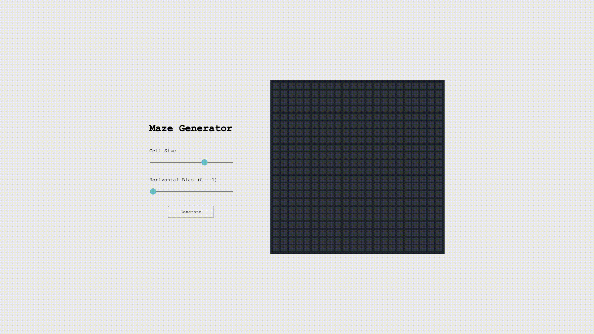

# [Maze Generator](https://maze-generator-jc.herokuapp.com/)
* Control using the sliders and then generate a maze!
* Try demo [here](https://maze-generator-jc.herokuapp.com/).

## Algorithm
**[Recursive Backtracking](https://en.wikipedia.org/wiki/Maze_generation_algorithm#Recursive_backtracker)**
* Make the initial cell the current cell and mark it as visited
* While there are unvisited cells
    * If the current cell has any neighbours which have not been visited
        * Choose randomly one of the unvisited neighbours
        * Push the current cell to the stack
        * Remove the wall between the current cell and the chosen cell
        * Make the chosen cell the current cell and mark it as visited
    * Else if stack is not empty
        * Pop a cell from the stack
        * Make it the current cell
